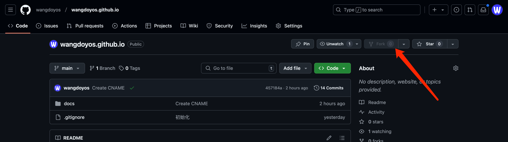
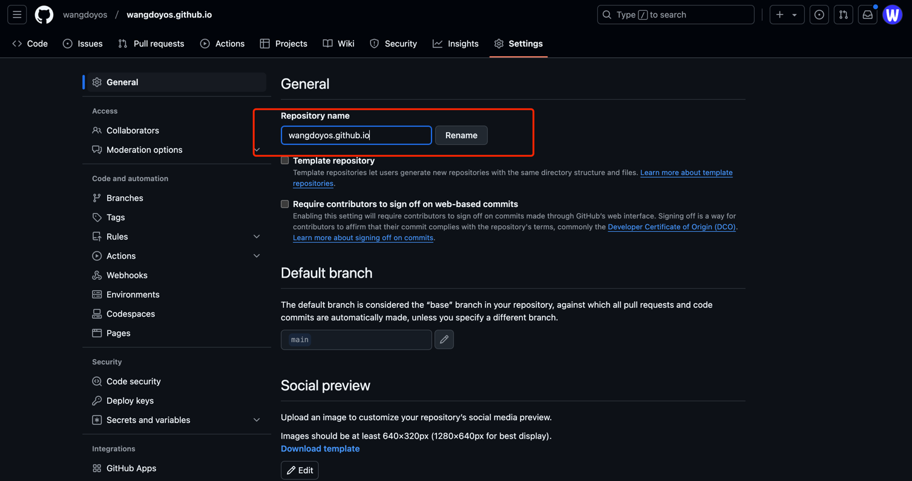
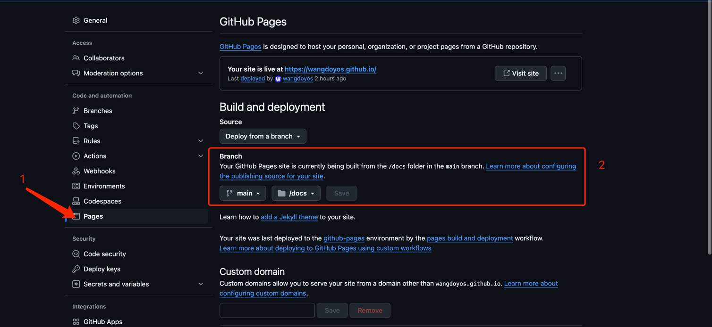
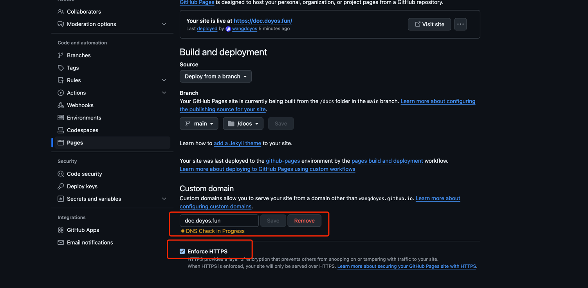

# 快速搭建

## 访问github

访问示例项目的github地址：https://github.com/wangdoyos/wangdoyos.github.io



点击右上角的fork，将示例仓库复制到你的github空间下

## 项目结构详解

```text
.
└── docs
    └── _media            图片文件夹
    ├── .nojekyll         防止 GitHub Pages 忽略下划线开头的文件
    ├── _coverpage.md     网站封面页
    ├── _navbar.md        右上方导航栏
    ├── _sidebar.md       左侧目录
    ├── index.html        docsify默认渲染页面
    ├── quickstart.md     快速搭建页
    ├── README.md         网站首页
```

## 修改仓库名

进入到你刚fork的github仓库中，点击上面的settings选项卡



在红框位置修改你的仓库名称，名称必须为 xxx.github.io 格式，其中 xxx 为你的github个人主页链接中的名称部分，如我的github

主页地址为：https://github.com/wangdoyos ，xxx就为 wangdoyos

!> **这里一定要按格式配置否则不生效!**

## 设置pages

点击左侧菜单中的 Pages 选项，进入如下界面



在页面中选择你的分支和存储文档的文件夹，这里我的是main分支，/docs文件夹下，配置好后就可以通过网址 https://xxx.github.io 来访问你的页面

## 自定义域名

在页面底部的 Custom domain 配置项的输入框中，填写你自己的域名，点击save。Enforce HTTPS建议勾选，勾选后你的网站只能通过HTTPS协议访问到。

!> **注意在你的域名服务商网站提前配好域名解析，CNAME指定到你的github域名。否则不生效！**



配置好后，你的网站将可以通过自定义域名访问。
